# CNN实现的手写数字识别

## 项目结构
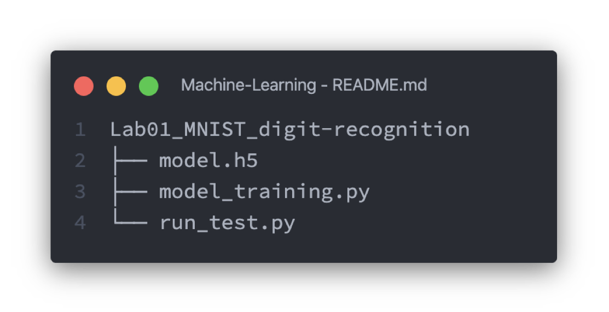

- `model.h5`            #模型文件
- `model_training.py`   #训练模型脚本
- `run_test.py`         #运行测试脚本

## 训练模型脚本 `model_training.py`

### 依赖库
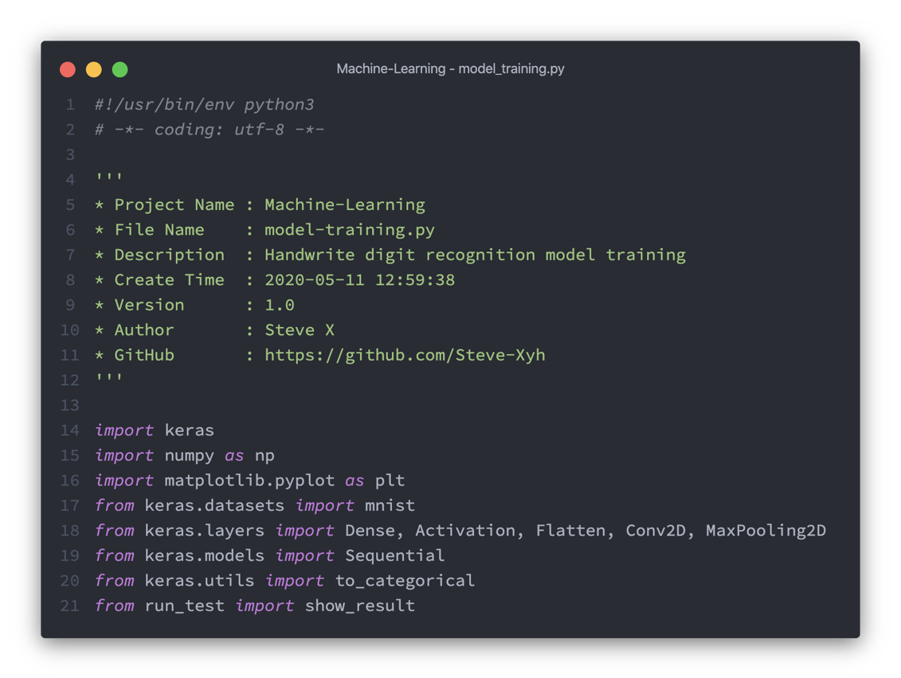

- `keras`
- `numpy`
- `matplotlib`

### 数据预处理
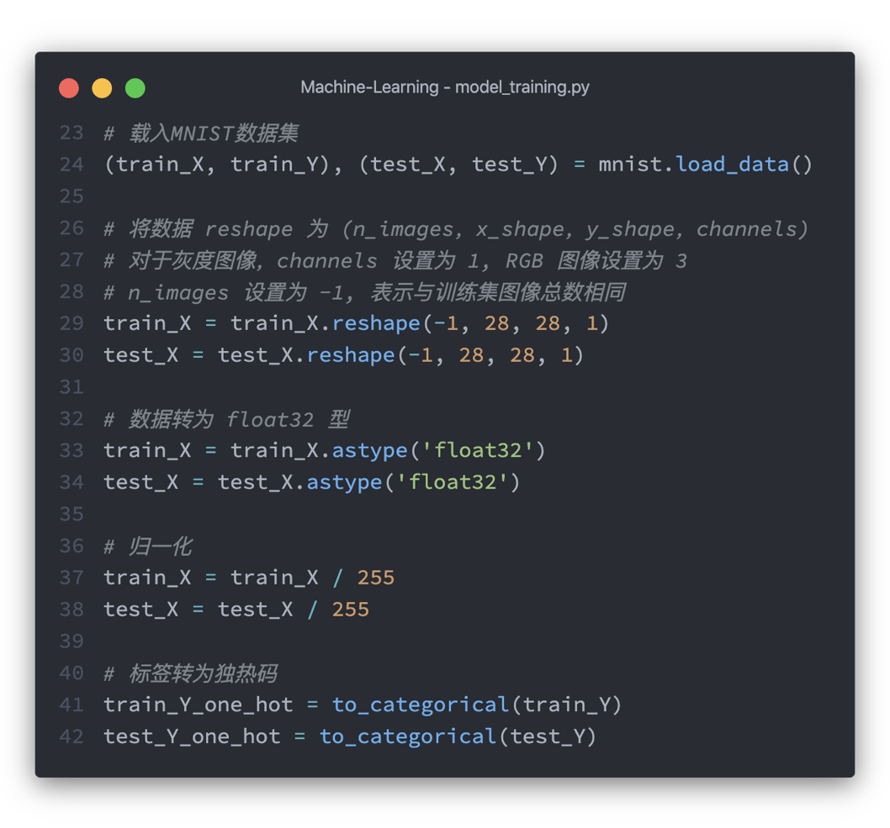

- 导入MNIST训练集、测试集
- reshape为(-1, 28, 28, 1)
- 归一化
- 独热码

### 构建模型
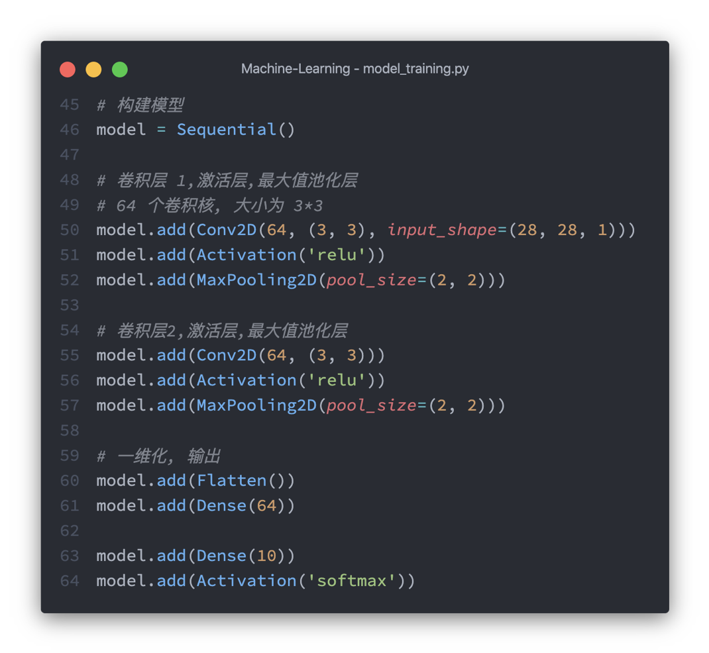

- 2层卷积
- 64个3*3卷积核
- 激活层
- 最大池化层
- 一维化
- 输出

### 训练模型
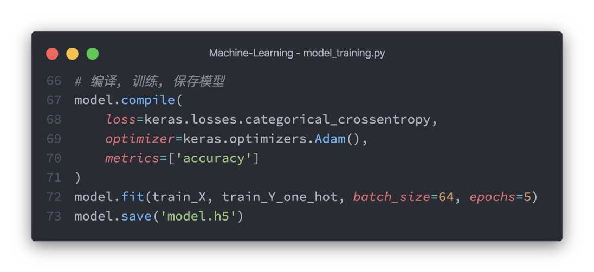

- 编译模型
- 训练模型
- 将模型保存为HDF5文件

### 评估模型准确度
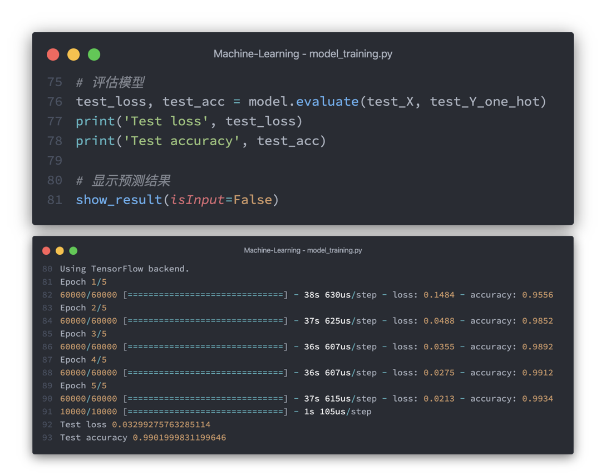

- 运行结果如图
- 迭代5轮
- 输出损失和精确度
- 调用运行测试脚本

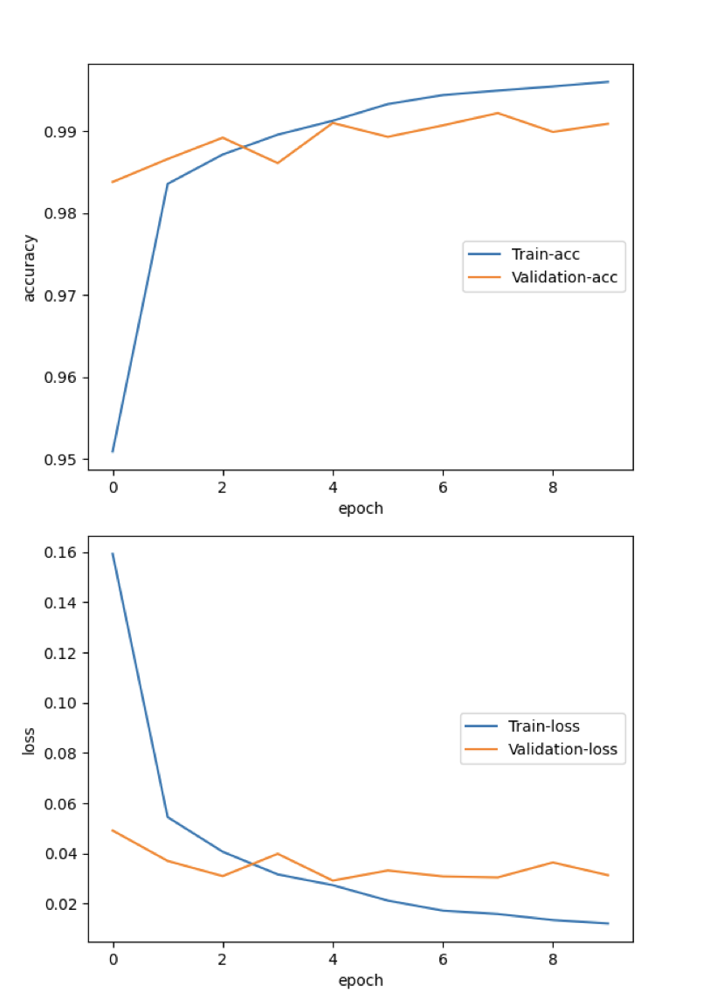

- 迭代10轮

### 查看模型结构
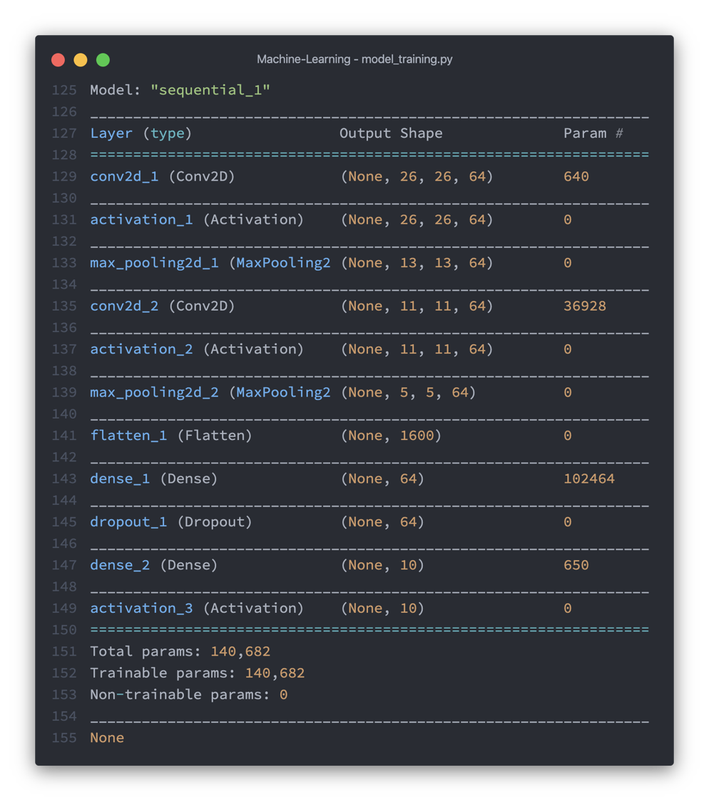

- `model.summary()`

## 运行测试脚本 `run_test.py`

### 载入模型和数据集
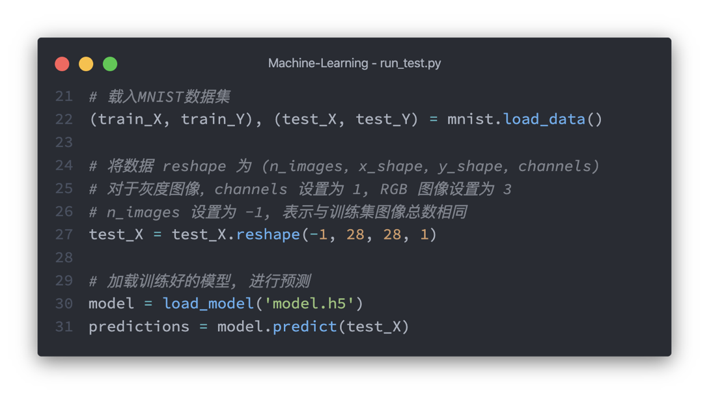

- 载入MNIST数据集
- 载入已训练好的模型
- 进行预测

### 测试数据
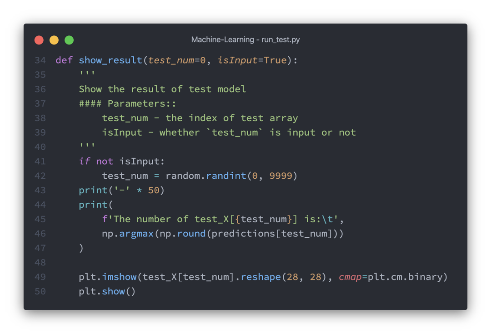

- 从0-9999随机选择一个下标
- 进行测试
- 显示结果

### 显示识别结果
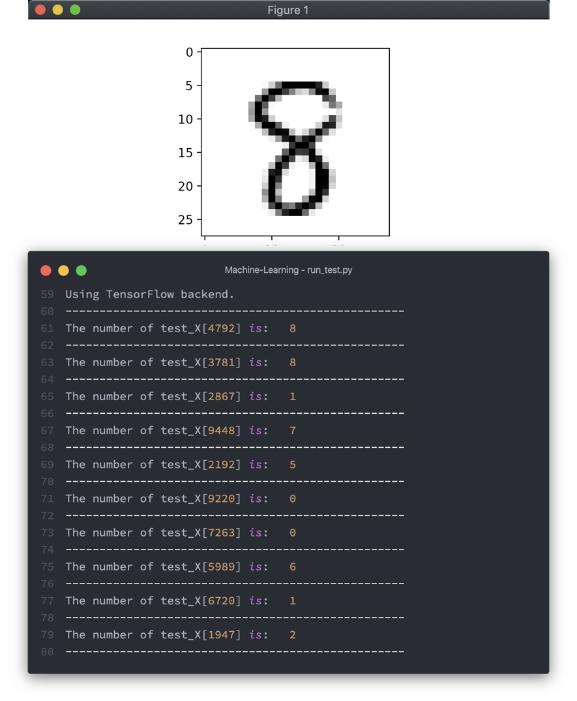

- 从0-9999随机选择一个下标
- 进行测试
- 显示结果
- 进行10次测试